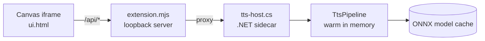

# Qwen TTS Studio canvas

An interactive canvas extension for the GitHub Copilot app that exercises local
Qwen3-TTS generation end to end: type text, pick a voice, listen to the result
in a standard audio player, and download the WAV.

It lives at `.github/extensions/qwen-tts-studio/` and is committed with the repo,
so anyone who opens this project in the Copilot app gets it automatically.

## Using it

Ask Copilot to open the canvas, or open it directly:

```text
Open the Qwen TTS Studio canvas
```

The panel exposes:

| Control | Purpose |
| --- | --- |
| **Text** | Text to synthesize, up to 10,000 characters |
| **Voice** | One of the 9 built-in speakers, read from the loaded model |
| **Language** | `auto` plus the languages in `QwenLanguageCatalog` |
| **Generate audio** | Starts synthesis and streams pipeline progress |
| **Cancel** | Cancels an in-flight generation |
| **Audio player** | Standard HTML5 player — play/pause, seek, progress, volume |
| **Download WAV** | Saves the generated file |
| **Recent generations** | Reloads any previous result back into the player |

Generated WAVs are written to
`~/.copilot/extensions/qwen-tts-studio/artifacts/`, so they survive canvas
closes, extension reloads, and app restarts. The full path is shown under the
player.

## How it works



- `extension.mjs` declares the canvas, serves `ui.html` on a loopback port per
  panel, and proxies `/api/*` to the sidecar.
- `tts-host.csproj` is a .NET 10 web host that references `ElBruno.QwenTTS.Core`
  directly and includes ONNX Runtime DirectML on Windows. It keeps **one `TtsPipeline`
  warm in memory**, so the ~5.5 GB ONNX model is loaded once per extension
  lifetime rather than once per generation. Synthesis runs as a cancellable job
  that reports the pipeline's `IProgress<string>` messages.
- The sidecar starts on first canvas open and stays alive across close/re-open
  cycles. It is stopped when the extension process exits.

### Model directory resolution

The sidecar reuses an existing complete model cache instead of downloading a
second copy. It checks, in order:

1. an explicit `--model-dir` argument,
2. `ModelDownloader.DefaultModelDir` (`%LOCALAPPDATA%/ElBruno/QwenTTS/models`),
3. its parent directory, which is where older library versions cached the model.

If none of them is complete, it downloads to `DefaultModelDir` and reports
byte-level progress in the canvas while loading.

## Agent actions

The canvas is also drivable by the agent through `invoke_canvas_action`:

| Action | Description |
| --- | --- |
| `get_status` | Model state, resolved model directory, available voices and languages |
| `generate_speech` | Starts a generation; returns a job id immediately |
| `get_generation` | Status, progress messages, elapsed time and result of a job |
| `list_generations` | Recent generations and their saved WAV file names |

## Runtime diagnostics

Expand **Runtime diagnostics** in the canvas to see the exact versions and
execution details used by the sidecar:

- `ElBruno.QwenTTS` library version and informational version
- .NET runtime version
- ONNX Runtime version
- selected execution provider (`DirectML`, `CPU`, or `Initializing`)
- GPU acceleration status for the language model
- vocoder execution provider (CPU)
- CPU fallback reason, if a GPU attempt failed
- process architecture and operating system

On Windows the canvas automatically tries **DirectML first** on the default GPU
(device 0), supporting NVIDIA, AMD, and Intel hardware with compatible drivers.
No CUDA toolkit is required. The vocoder stays on CPU because its operators are
not fully supported by DirectML; ONNX Runtime may also assign unsupported
language-model operators to CPU.

If GPU setup fails, the host initializes a CPU pipeline. ONNX sessions load lazily,
so a GPU provider or graph failure during synthesis also disposes the GPU pipeline
and retries that request **once on CPU**. Subsequent requests keep the CPU pipeline
until the extension is reloaded. Cancellation and invalid-input errors do not
trigger a retry. Runtime diagnostics show the selected backend, not a per-operator
GPU utilization measurement, and retain any fallback reason.

On non-Windows platforms this canvas uses the CPU runtime. For other GPU backends,
see [gpu-acceleration.md](gpu-acceleration.md).

## Performance note

GPU acceleration can reduce language-model inference time, but the first generation
also loads and prepares the ONNX sessions. CPU fallback can take several minutes
for a few seconds of audio. Generation remains a background job with live progress
and a cancel button, and the model stays warm between requests.

## Requirements

- .NET SDK 10.0 or later (`dotnet run` builds the sidecar on first use)
- The Qwen3-TTS 0.6B CustomVoice model (downloaded automatically if missing)
